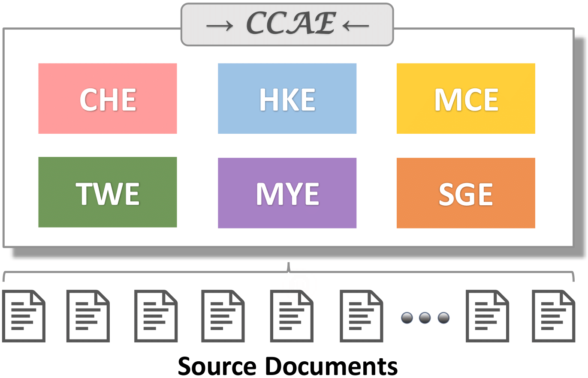
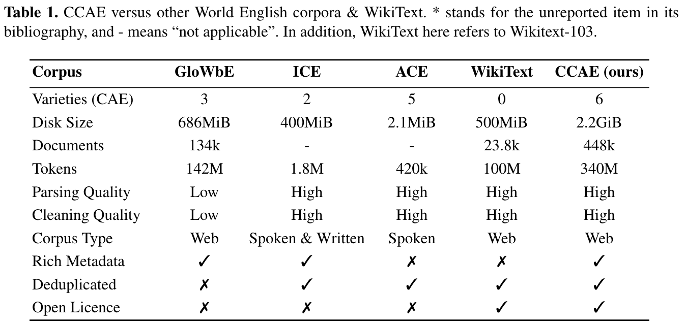
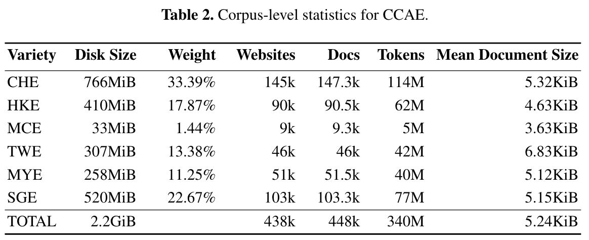
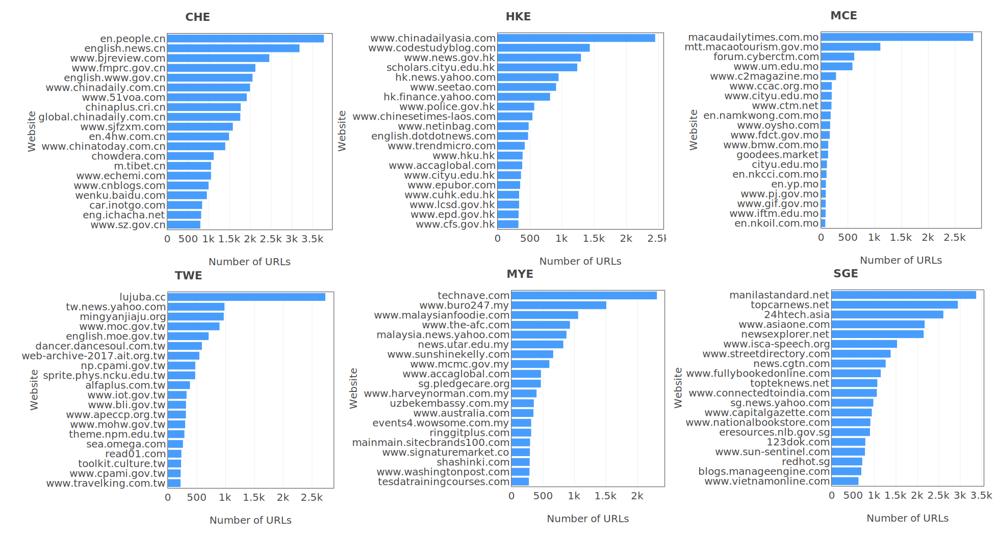
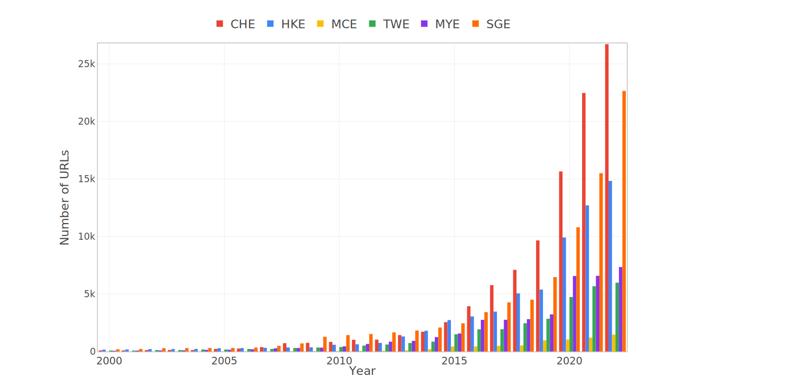
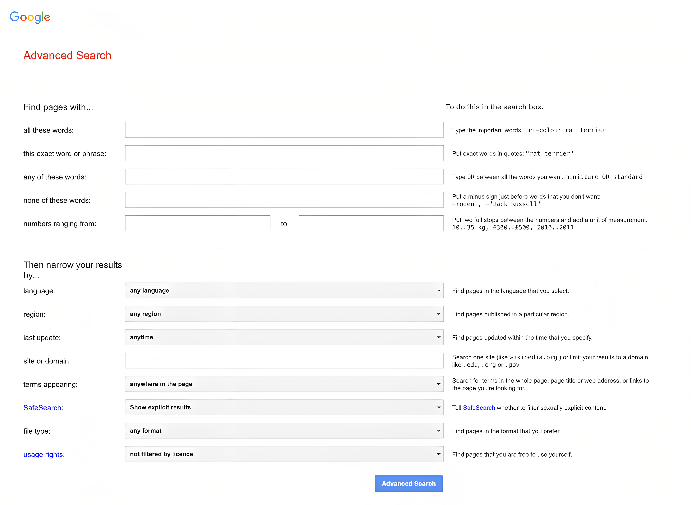

# CCAE: A Corpus of Chinese-based Asian Englishes
[📄 **Paper**](127.0.0.1:8000) **·** [📚 **Dataset**](https://huggingface.co/datasets/CCAE/CCAE-Corpus) **·** [📌 **Poster**](https://github.com/jacklanda/CCAE/blob/main/assets/poster.jpg) **·** [💻 **Code**](https://github.com/jacklanda/CCAE)

## Overview
Language models have been foundations in various scenarios of NLP applications, but it has not been well applied in language variety studies, even for the most popular language like English. This paper represents one of the few initial efforts to utilize the NLP technology in the paradigm of World Englishes, specifically in creating a multi-variety corpus for studying Asian Englishes. We present an overview of the CCAE — Corpus of Chinese-based Asian English, a suite of corpora comprising six Chinese-based Asian English varieties. It is based on 340 million tokens in 448 thousand web documents from six regions. The ontology of data would make the corpus a helpful resource with enormous research potential for Asian Englishes (especially for Chinese Englishes for which there has not been a publicly accessible corpus yet so far) and an ideal source for varietyspecific language modeling and downstream tasks, thus setting the stage for NLP-based World Englishes studies. And preliminary experiments on this corpus reveal the practical value of CCAE. Finally, we make CCAE available at https://huggingface.co/datasets/CCAE/CCAE-Corpus.

<!---->
<p align="center">
    
</p>

<br>

The CCAE has the following major properties:
- It is the first and largest open-access web-crawled corpus for the Chinese Englishes and Chinese-based Asian Englishes.
- It is the first and largest NLP-oriented corpus for Asian Englishes and World Englishes.
- It is a clean and deduplicated corpus in the document level. Taking into account the significance of data quality for dependent tasks, we introduce custom pipeline to conduct data cleaning.
- It maintains the traceability of each document to its origin. This level of traceability makes it possible for researchers to apply the withdrawal right of individual website owners or individual persons whose data are cited on websites and are protected by GDPR. It allows researchers to systematically exclude blacklisted websites.
- It serves as the initial data resource for potential usage on downstream tasks like language variety identification, lexical variation identification, and so on.

## Related Work
As shown in Table 1, we compare CCAE with four other corpora. Here, we simply illustrate them1, which is web-based or manually curated.

<p align="center">
    
</p>

<br>

**GloWbE.** The corpus of Global Web-based English is a large-scale collection of 1.8 million web pages from 20 English-speaking countries, containing over 1.9 billion tokens. It provides linguistic annotations like PoS to support the investigation of how English is used globally.

**ICE.** The International Corpus of English is a collection of spoken and written English from 20 regions where English is used as the first or second language. It includes over 1,000 texts and 1,200 hours of audio recordings, making it a valuable resource for studying varieties of English language use across regions and cultures around the world.

**ACE.** The Asian Corpus of English, an Asian English-oriented corpus capturing spoken ELF (English as a lingua franca) interactions in various regions of Asia.

**WikiText-103.** WikiText-103 consists of over 100 million tokens extracted from English Wikipedia, it is commonly used as a benchmark dataset for training and evaluating language models. This corpus can be deemed as one of the representations of Inner-circle English.


## CCAE at a Glance
To comprehend accurately, it is essential to understand the origin of the texts that form it. Therefore, we describe CCAE’s text and metadata respectively in terms of (1) corpus-level statistics, (2) the frequency of various internet domains as text sources, and (3) the utterance date when the websites were initially indexed.


### Corpus-level Statistics
We collected a total of 101GB WARC(Web ARChive) files for the CCAE. After document-level deduplication, the corpus is composed of 448k documents and 340M word tokens(measured by SpaCy tokenization). Basic statistics of the disk size for the cleaned corpus, collected websites, documents, and tokens are displayed in Table 2.

<p align="center">
    
</p>

### Domains Distribution
We have conducted analysis on the highest frequent top-level domains (TLD) for each variety. Predictably, most of the represented URLs are from some popular top-level domains like .com,
.net, and .org. Apart from this common case, the URLs mainly consist of variety-corresponding TLD, for instance, “Chinese Mainland” has nearly 57% portion for “.cn”, and “Hong Kong” has 34% portion for “.hk”. In addition, we present the top 20 highest frequently occurring websites for each variety in Figure 2, to display the distribution of text across different websites for each variety.

In addition, we present the top 20 highest frequently occurring websites for each variety in Figure 2, to display the distribution of text across different websites for each variety.

<p align="center">
    
</p>

### Utterance Date
Language undergoes change quickly, and the accuracy of statements depends on when they were made. We attempted to determine the date of each document by examining the publish date from two sources: Google search and Internet Archive4. We used the earlier date as the publish date for each web page. We note that the use of the Internet Archive is not perfect, as it sometimes indexes pages months after their creation and only indexes around 65% of the URLs in CCAE. For web pages with unknown dates, we marked them as “NULL” in later storage.

<p align="center">
    
</p>

As shown in the above figure, regardless of variety, we found that the dates of approximately 96% URLs were distributed from 2011 to 2022. In addition, there is also a significant amount of data that was written 10 years before the data collection period (from 2022/01 to 2022/06), indicating a long-tailed distribution.

## Our Spider System
We implemented a light-weight spider system for crawling text data from genre type of webpage by Google Advanced Search 🤗.

<p align="center">
    
</p>

<br>
Google Advanced Search

<br>

<p align="center">
    
</p>

## License
The code in the repository is licensed under the [MIT License](https://github.com/jacklanda/CCAE/blob/main/LICENSE)

## Contributors
Yang Liu, Melissa Xiaohui Qin

## Acknowledgement
Many thanks to Mark Davis, for his useful suggestions on data collection. We also thank the Internet Archive for providing service on the website time archive. This work was supported in part by the National Natural Science Foundation of China under Grant 62002016 and in part by the Fundamental Research Funds for the Central Universities under Grant 06500103.

## Citing CCAE
If you use CCAE's data or code in your research, please use the following BibTeX entry. (To-be updated: ⚠️)

```latex
@article{yangliu2023ccae},
  title={CCAE: A Corpus of Chinese-based Asian Englishes},
  author={Yang Liu, Melissa Xiaohui Qin, Long Wang and Chao Huang},
  year={2023}
}
```
